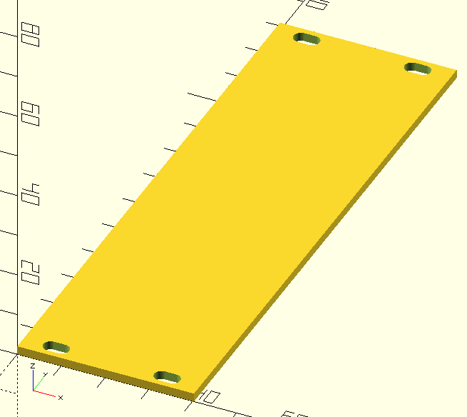
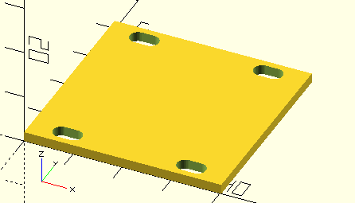
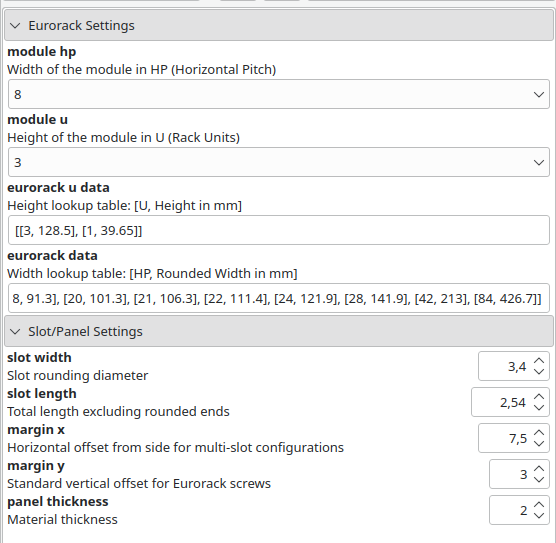

## Eurorack Parametric Front Panel Generator

A parametric OpenSCAD script designed to generate Eurorack front panels following Doepfer (3U) and Intellijel (1U) standards. This tool allows for quick generation of blank panels or base templates for module design with automated mounting slot placement.

### Features

Standard Compliance: Supports 3U (128.5mm) and 1U (39.65mm) height standards.

Accurate Widths: Includes a lookup table for HP to mm conversion, accounting for the standard manufacturing tolerances (rounded widths).

### Intelligent Slot Placement:

Modules $\le$ 2 HP: Single centered slot.

Modules $\le$ 4 HP: Single offset slot.

Modules $\ge$ 6 HP: Dual offset slots for maximum stability.

### Fully Parametric: Adjust panel thickness, slot dimensions, and margins easily.

#### Customizer Settings

The script is optimized for the OpenSCAD Customizer. You can adjust the following parameters without touching the code:

#### Eurorack Settings

module_hp: Set the width of the module. Available presets range from 1 HP to 84 HP (full rack width).

module_u: Toggle between 3U (standard rack height) and 1U (Intellijel format).

#### Slot Settings

slot_width: Diameter of the mounting screw holes (default: 3.4mm for M3 screws).

slot_length: The horizontal "stretch" of the slot to allow for easier rack alignment.

panel_thickness: Thickness of the front panel (default: 2mm).

margin_x: Horizontal distance from the panel edge to the center of the slot (default: 7.5mm).

margin_y: Vertical distance from the top/bottom edge to the center of the slot (standard: 3.0mm).

#### Standards References

Width (HP): Based on Doepfer A-100 Mechanical Specifications.

Height (1U): Based on Intellijel 1U Technical Specifications.

### Usage

Open eurorack_lookup.scad in OpenSCAD.

Open the Customizer window (Window -> Customizer).

Select your desired HP width and U height.

Render (F6) and Export as STL (F7).